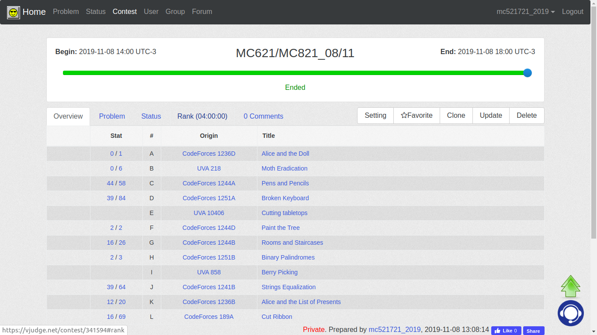
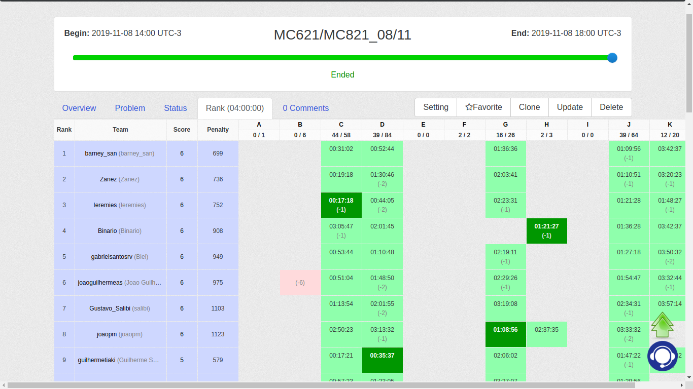
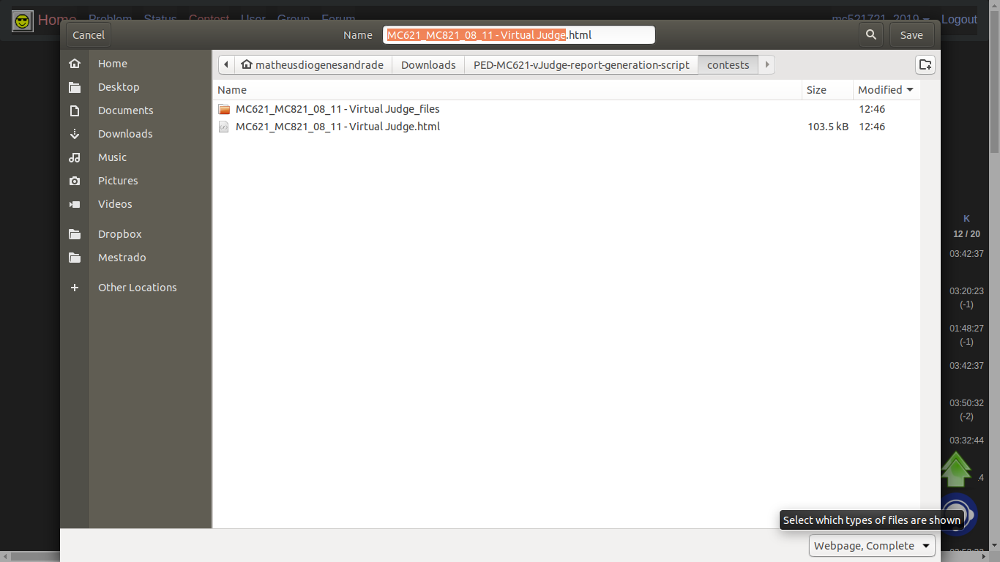
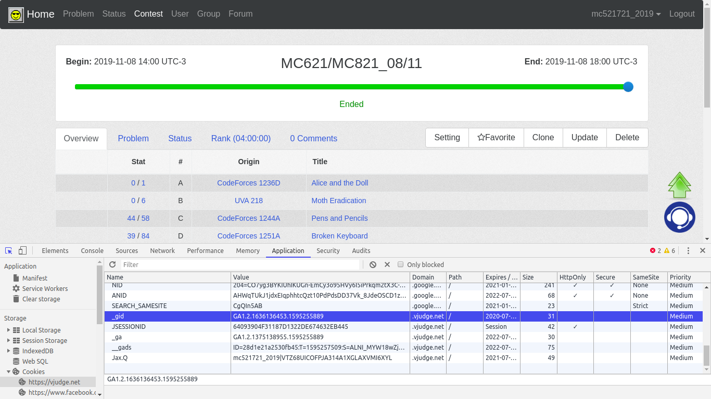
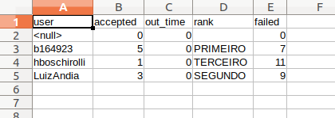

# PED-MC621 vJudge report generation script

This repository contains a script to generate reports from vJudge contests. This script was developed when I was a teaching assistant of the course "Programming Challenges II" or [MC621](https://www.dac.unicamp.br/portal/caderno-de-horarios/2018/2/S/G/IC/MC621). The script **main.py** was implemented in [python 3](https://www.python.org/download/releases/3.0/) using the library [BeautifulSoup](https://www.crummy.com/software/BeautifulSoup/bs4/doc/).

To use the script, follow the steps:

1. First, you have to download the full loaded contest HTML files you wish to generate the report.



2. Click at the tab 'Rank'.



3. And then, download the page at the *contests* folder by pressings Ctrl + s, make sure that the option "Webpage, Complete" at the right bottom of the pop-up is selected:



Step 2 is a mandatory requirement for the script correct execution because the rank tab content is loaded through Ajax.

4. In the file *main.py*, the *cookies* dictionary contains the cookies information required to perform the HTTP requests, to find the right values to these fields:
  1. Go to the vJudge.net;
  2. Sign in; 
  3. Open the browser page inspector (Ctrl + Shift + i on chrome); 
  4. Select the *Application* tab
  5. At the *Storage* section, select the *Cookies > http://vjudge.net* subsection, 
  6. And copy and paste the fields *Jax.Q*, *_gid*, *JSESSIONID*, and *_ga* values to the *cookies* dictionary. As the image below presents:



5. The *contests* array contains the directory to the contests *HTML* files. 
```python
contests = [
        'contests/MC621_MC821_08_11 - Virtual Judge.HTML',
        ]
```
Fill this array with your downloaded files directories.

6. The *usernames* array contains the list of vJudge contests usernames.
```python
usernames = [
        'LuizAndia',
        'b164923',
        'hboschirolli',
        ];
```
Fill this array with the vJudge contests usernames.

7. The *usernames_to_present* array contains the usernames presentation order allowing you to insert some break lines between the names.

8. Now, run *python main.py* and open the generated *.csv*.

  8.1. Case you want to see the program logs while it runs, you can run with the verbose argument (*python main.py --verbose*).



Any doubts feel yourself free to reach me out: m228117@dac.unicamp.br
